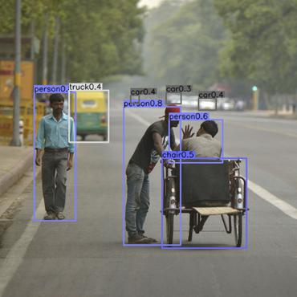

# Real Time Object Detection using YOLO V3

1. We import cv2, numpy libraries. 
2. Then we load darknet architecture in net and in classes we store all the different object from coco.names file.
3. And get the last layer from net so as to identify object in final layer.

